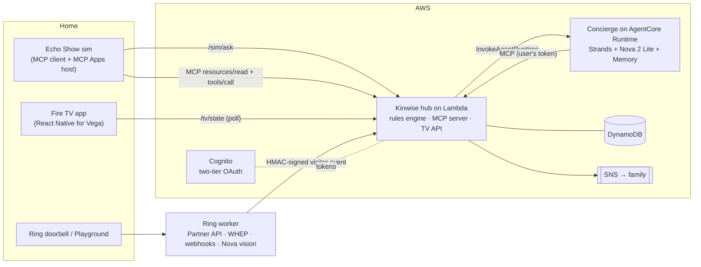

# Kinwise

**A consent-first family safety net that stops a courier scam in the gap between the phone call and the front door, using Alexa+, Ring and Fire TV.**

Built for the [Amazon AppDev 2026 hackathon](https://amazonappdev2026.devpost.com/) · tracks: **Fire TV**, **Alexa+**, **Ring** · mini-challenges: **AWS Builder**, **Open Source**

> 🎬 Demo video: _add link_ · 📝 Devpost: _add link_

---

## The problem

Courier scams have two steps. First a caller posing as a bank, the FTC or the police convinces an older adult that their money is in danger. Then a "courier" comes **to the home** to collect cash or gold.

- Americans 60+ reported **$7.7 billion** in fraud losses to the FBI in 2025, about 60% more than in 2024 ([AARP on FBI IC3 2025](https://www.aarp.org/money/scams-fraud/fbi-ftc-report-2025-losses/)).
- In FBI Boston's courier-pickup cases, **nearly 98% of victims were over 60** and losses topped **$26 million** ([FBI Boston](https://www.fbi.gov/contact-us/field-offices/boston/news/fbi-boston-warns-of-increase-in-gold-bar-and-bulk-cash-courier-scams)).
- **63 million** Americans are family caregivers ([AARP 2025](https://www.aarp.org/press/releases/2025-07-24-new-report-reveals-crisis-point-for-americas-63-million-family-caregivers.html)), and Amazon has since retired Alexa Together.

No single device sees both steps. The conversation happens in one place and the hand-off happens at the door. **Kinwise joins them up.**

## What it does

1. **10:15** Asha (78, lives alone) tells Alexa: *"Remind me at 2: a courier from the bank is picking up a package."* Kinwise saves the reminder, notices two warning signs and gently asks whether someone called her.
2. **10:20** *"A man from the FTC called… withdraw my savings as gold… a courier will come… don't tell my family. Is that real?"* Kinwise finds 5 of its 6 courier-scam warning signs and explains them kindly. It starts watching the door more closely for 6 hours and lets her daughter Priya know, as a signal only.
3. **14:41** A stranger rings the Ring doorbell. **Asha's Fire TV shows the Pause**: *"Pause before you open the door. No visit is expected right now."* Priya's recorded message appears with captions, and **[Call Priya]** is already focused on the remote.
4. Asha presses it. Priya's phone gets a call request. Later Priya asks her own Alexa, *"How's Mom's day?"*, and sees a timeline of **signals, never recordings**.

On ordinary days the TV is Asha's calm **Today at Home** board: expected visitors (the gardener at 10 doesn't trigger anything), reminders and family messages.

## How each Amazon technology is used at runtime

| Track | Where | What runs |
|---|---|---|
| **Alexa+** | [`packages/hub/src/mcp/server.ts`](packages/hub/src/mcp/server.ts), [`packages/hub/src/http/app.ts`](packages/hub/src/http/app.ts) | A self-hosted **MCP server** (spec **2025-11-25**, **Streamable HTTP**, stateless, MCP TS SDK v2). It has 9 role-scoped tools with `outputSchema` + `structuredContent`, annotations and icons, plus 4 **MCP Apps** UI cards (`ui://kinwise/*`). It follows Alexa+'s **two-tier OAuth** (`mcp:service` / `mcp:tools` / `mcp:resources`): RFC 9728 metadata, 401 without `WWW-Authenticate`, 403 on bad `Origin`, read tools p95 **< 10 ms** against the 500 ms budget. |
| Alexa+ (surface) | [`agents/concierge`](agents/concierge), [`packages/echo-sim`](packages/echo-sim) | The **simulated Alexa+ experience** (clearly labelled). The concierge is a **Strands** agent that calls the MCP server with the speaker's own token, like account linking. The Echo Show simulator is a real **MCP client + MCP Apps host** (AppBridge, sandboxed iframes). The same cards render in Claude and in VS Code. |
| **Ring** | [`agents/ring-worker`](agents/ring-worker) | The official **Ring Partner API** (`api.amazonvision.com`). It lists devices, polls event history, grabs a frame over a **WHEP live-view** session (aiortc), and runs a **signed-webhook** receiver (HMAC, `request_id` dedupe, 200 within 5 s). It works on the **Ring Developer Playground** or a linked device. Perception (Nova 2 Lite) reports presence and a neutral description only, never identity. |
| **Fire TV** | [`packages/tv-app`](packages/tv-app) | A **React Native for Vega** app (Vega OS, `com.kinwise.tv`). D-pad-first 10-foot UI: onboarding and consent, Today at Home, the Pause, gentle and expected overlays, settings and access log, plus VoiceView announcements and caption-first video. [`packages/tv-preview`](packages/tv-preview) renders the same `src/` in a browser for development. |
| **AWS Builder** | [`infra/`](infra), [`agents/concierge`](agents/concierge) | **Bedrock AgentCore Runtime** (concierge) + **AgentCore Memory**, **Strands Agents** (Bedrock model + MCP client + hooks), **Amazon Nova 2 Lite** (dialogue and vision), Lambda (ARM64) + API Gateway, **Cognito** (Alexa+ two-tier OAuth), DynamoDB, SNS, Secrets Manager, X-Ray. All CDK, all tested. |
| **Open Source** | [`packages/alexa-plus-mcp-kit`](packages/alexa-plus-mcp-kit) | **`alexa-plus-mcp-kit`**: a new Apache-2.0 library that makes any MCP SDK v2 server follow the Alexa+ add-on auth contract (two-tier scopes, RFC 9728, Alexa-style 401, Origin 403). It includes an `alexa-mcp-conformance` CLI that any Alexa+ track team can run. The Kinwise hub uses it in production code (16/16 checks). |

**The model never makes safety decisions.** The scam signals, risk windows and the door decision are deterministic and explainable, and they are unit-tested ([`packages/hub/src/domain`](packages/hub/src/domain), spec §5). AI does two things only: it talks with people kindly, and it describes what the camera sees, neutrally.

## Architecture



Full design: [`docs/spec.md`](docs/spec.md).

## Privacy and dignity are enforced in code

| Rule | Where it's enforced |
|---|---|
| The resident owns every switch: consent and privacy time are set only from her TV or her own voice | `requireResident` in [`services/kinwise.ts`](packages/hub/src/services/kinwise.ts) |
| Family sees **signals, not streams**: no transcripts, frames or reminder text | `todayView(…, includeReminders=false)`, timeline copy, notifier contract |
| The words of a checked call are **never stored**, only category labels | `checkCall` + a test that greps the stored state |
| **No faces, no identity, no appearance**: perception is presence plus a neutral sentence, with a banned-words filter | [`agents/ring-worker/src/kinwise_ring/perception.py`](agents/ring-worker/src/kinwise_ring/perception.py) |
| Appearance is **never** an input to the door decision | [`domain/decide.ts`](packages/hub/src/domain/decide.ts) |
| Privacy time stores **nothing**, only a counter | `ingestVisitor` |
| Every family read appears in the resident's **access log** | `logAccess` |
| **Advise, never control**: no locks, no police, everything dismissible | product design + tool annotations |

## Run it locally (about 5 minutes, no AWS needed)

Prerequisites: **Node 22+**, **[uv](https://docs.astral.sh/uv/)** (Python 3.11+).

```bash
node scripts/setup.mjs            # installs all packages
node scripts/dev.mjs --offline    # hub :8787 · concierge :8081 · Echo sim :5173 · TV preview :5174
```

Open **http://localhost:5173** (Echo Show) and **http://localhost:5174** (Fire TV preview) side by side. Then:
- tap Asha's suggestion chips (reminder, then "Is that real?"), and
- press **Ring the doorbell** in the demo controls. The TV shows the Pause.

Or script the whole story with `node scripts/demo-scenario.mjs`.

With AWS credentials that can call Bedrock, drop `--offline` and the concierge uses **Nova 2 Lite** through Strands.

| Check | Command |
|---|---|
| MCP conformance (22 checks, incl. Alexa+ auth tiers and latency) | `npm run conformance -w @kinwise/hub` |
| Generic Alexa+ conformance CLI (open-source kit) | `node packages/alexa-plus-mcp-kit/dist/cli.js --url http://localhost:8787/mcp --token dev-asha --service-token dev-service` |
| All JS/TS tests | `npm test` (root), plus `npm test` in `packages/echo-sim` and `packages/tv-preview` |
| Python tests | `uv run pytest -q` in `agents/concierge` and `agents/ring-worker` |

Any MCP Apps host can use the server. For example, add `http://localhost:8787/mcp` with header `Authorization: Bearer dev-asha` to an MCP client such as MCP Inspector or Claude.

**Ring Developer Playground:** paste a Playground token into `agents/ring-worker/ring-token.txt`, then run `node scripts/dev.mjs --ring live`. See [`agents/ring-worker/README.md`](agents/ring-worker/README.md).

**Fire TV (Vega OS):** build `packages/tv-app` with the Vega SDK on Ubuntu or macOS and run it in the Vega Virtual Device. See [`packages/tv-app/README.md`](packages/tv-app/README.md).

## Deploy to AWS

```bash
cd agents/concierge && uv run python scripts/package.py   # ARM64 bundle for AgentCore (no Docker needed)
cd ../../infra && npx cdk deploy
node ../scripts/demo-tokens.mjs                           # hosted-demo tokens for testers
```

Details: [`infra/README.md`](infra/README.md).

## Repository map

```
packages/hub          rules engine · MCP server (+ MCP Apps cards) · Fire TV API · ingestion   (TypeScript)
packages/alexa-plus-mcp-kit  open-source Alexa+ MCP auth kit + conformance CLI                 (TypeScript, Apache-2.0)
packages/echo-sim     Echo Show simulator: MCP client + MCP Apps host                          (React)
packages/tv-app       Fire TV app for Vega OS                                                  (React Native for Vega)
packages/tv-preview   browser preview of tv-app                                                (react-native-web)
agents/concierge      simulated Alexa+ orchestrator on AgentCore                               (Python, Strands)
agents/ring-worker    Ring Partner API / Playground worker                                     (Python)
infra                 AWS CDK app                                                              (TypeScript)
docs                  spec, friction log, product feedback notes
scripts               setup · dev · demo scenario · demo tokens
```

## Status and honest limits

- **Alexa+**: participants can't connect to live Alexa+, so the Alexa+ surface is a **simulation** (labelled on screen). The MCP server itself is real, standards-compliant and runnable by judges.
- **Fire TV**: the Vega SDK doesn't run on Windows. The app mirrors Amazon's Vega sample layout and builds with the Vega SDK on Linux or macOS. The browser preview runs the same `src/`.
- **Ring**: built against the official Partner API and the Developer Playground, where webhooks are unconfirmed, so live-view frame sampling is the primary path.
- Third-party Fire TV apps can't draw over other apps, so the Pause shows while Kinwise is the TV's home screen. The Echo and the family alert are the backup channels.

## License

[Apache-2.0](LICENSE)
